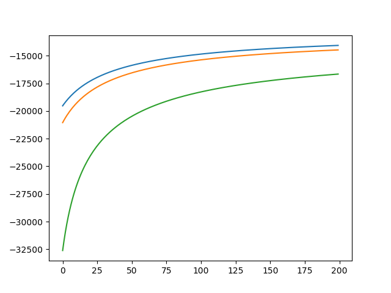

# 第十章作业

2015011313 徐鉴劲 计54

## 运行代码验证实验

python hw5.py即可。

MLE可能非常慢，需要五分钟左右。

## Kmeans的实现方法

通过sklearn的库函数sklearn.cluster.KMeans实现。

## MLE的原理与实现

### 原理推导

假设数据的产生是$x \sim P(x | \theta) = \sum P(x | \omega_i, \theta_i) P(\omega_i)$，即是每一个类又一个产生概率，然后乘上每一个类的先验概率。

以最大化似然函数转化成最大化l:$l = \sum_i ln(P(x_i|\theta))$

对参数求导：$\nabla_{\theta_i} l = \sum_k \frac{P(\omega_i)}{P(x_k|\theta)} \nabla_{\theta_i} P(x_k | \omega_i, \theta_i) = \sum_k P(\omega_i | x_k, \theta) \nabla_{\theta_i} P(x_k | \omega_i, \theta_i)$

前一项$P(\omega_i | x_k, \theta) = \frac{P(x_k| \omega_i, \theta_i)P(\omega_i)}{\sum P(x_k| \omega_i, \theta_i)P(\omega_i)}$。

后一项是具体建模函数的求导。

进行更加具体化的实现，我们假定建模函数是$f_i(x; \theta_i) = P(x_k |\omega_i, \theta) = \mathcal{N}(\mu_i, \sigma_i^2)$，同时还有一个先验系数$t_i$。

整体的函数就是$f(x; \theta) = \sum f_i(x) t_i = P(x | \theta)$，表示一个数据点的概率。

所以$l = \sum_i ln(f(x_i; \theta))$

$\nabla_{\theta_i} l = \sum_k \frac{t_i}{f(x_k; \theta)} \nabla_{\theta_i} f_i(x_k; \theta_i)$

同样，还有对于先验的求导：

$\nabla_{t_i} l = \sum_k \frac{f_i(x_k; \theta_i)}{f(x_k; \theta)}$

由于$f_i(x; \theta_i) = \mathcal{N}(x; \mu_i, \sigma_i^2) = \frac{1}{\sqrt{2\pi}\sigma}e^{-\frac{(x-\mu_i)^2}{2\sigma_i^2}}$

所以$\nabla_{\mu_i} f_i(x; \theta_i) = \frac{x - \mu_i}{\sigma_i^2} f_i(x; \theta_i)$，
$\nabla_{\sigma_i} f_i(x; \theta_i) = \frac{(x-\mu_i)^2}{4\sigma_i^3} f_i(x; \theta_i)$

### MLE 的算法实现

在题目中，假定(x, y, z)三个变量是相互独立的，可以每次对一个坐标进行MLE，然后再综合起来，不然计算量大大增加。

我们首先随机初始化各个参数，包括$\mu_i$, $\sigma_i$, $t_i$。

然后使用梯度下降对参数进行优化：

$\nabla_{t_i} l = \sum_k \frac{f_i(x_k; \theta_i)}{f(x_k; \theta)}$

$\nabla_{\mu_i} l = \sum_k \frac{t_i}{f(x_k; \theta)} \frac{x_k - \mu_i}{\sigma_i^2} f_i(x_k; \theta_i)$

$\nabla_{\sigma_i} l = \sum_k \frac{t_i}{f(x_k; \theta)} \frac{(x-\mu_i)^2}{4\sigma_i^3} f_i(x_k; \theta_i)$

### MLE 代码

关于MLE的代码一共有：

`get_fi`：计算$f_i$函数。

`dataset_loss`: 计算log likelihood的数据集合损失函数。

## 练习 1

所有练习都是在一次初始化下完成的。

### Kmeans(N=2)

按照上述方法进行Kmeans分类，结果如下：

|参数|x|y|z|
|:--|:--|:--|:--|
|$\mu_1$   |2.70767|2.70005|1.26561|
|$\sigma_1$|3.85410|4.20658|3.74709|
|$\mu_2$   |7.79693|9.30730|13.16293|
|$\sigma_2$|5.98297|5.69897|6.16273|

可以调用代码中KMeans函数进行验证。

### MLE（N=2)

随机选定了一个值作为参数初始化，采用0.2学习率进行最优化，得到参数如下：

|参数|x|y|z|
|:--|:--|:--|:--|
|$t_1$|0.515|0.491|0.469|
|$t_2$|0.485|0.509|0.531|
|$\mu_1$   |1.36|1.29|0.867|
|$\sigma_1$|3.43|3.24|3.38|
|$\mu_2$   |6.87|7.22|7.55|
|$\sigma_2$|4.96|5.14|6.43|

训练loss曲线如下：

横轴是迭代次数，纵轴是loss的值。三条曲线分别是x，y，z各自的loss。

### MLE(N=2)经过KMeans初始化

训练loss曲线如下：

横轴是迭代次数，纵轴是loss的值。三条曲线分别是x，y，z各自的loss。

### 对比分析

MLE的结果比Kmeans准确，经过初始化后的MLE结果更加准确。

## 练习 2

### Kmeans(N=3)

|参数|x|y|z|
|:--|:--|:--|:--|
|$\mu_1$   |1.84897|1.79317|1.67362|
|$\mu_2$   |6.60972|7.38586|17.31791|
|$\mu_3$   |9.04562|10.96022|3.87745|
|$\sigma_1$|2.76104|2.77064|3.35083|
|$\sigma_2$|5.69546|5.65530|5.53523|
|$\sigma_3$|5.36132|4.61385|5.52803|

准确率是43.7%.

### MLE（N=3)

|参数|x|y|z|
|:--|:--|:--|:--|

|$\mu_1$   |1.34249|1.26025|0.74879|
|$\mu_2$   |4.83537|4.88901|4.93523|
|$\mu_3$   |10.88278|10.98627|11.74815|
|$\sigma_1$|3.06363|3.00015|3.40527|
|$\sigma_2$|2.40334|2.32590|2.19743|
|$\sigma_3$|3.10318|3.23603|4.34140|

准确率是90%

### MLE(N=3)经过KMeans初始化

|参数|x|y|z|
|:--|:--|:--|:--|
|$\mu_1$   |1.96196|1.84134|1.70183|
|$\mu_2$   |6.61506|7.38438|17.30537|
|$\mu_3$   |9.06733|10.97672|3.88240|
|$\sigma_1$|3.46472|3.46753|3.85795|
|$\sigma_2$|5.87325|5.84069|5.74550|
|$\sigma_3$|5.54480|4.81557|5.84515|

准确率是95%

### 结果比较

Kmeans的结果最差，MLE未经过初始化的次之，最好的是经过初始化的MLE.