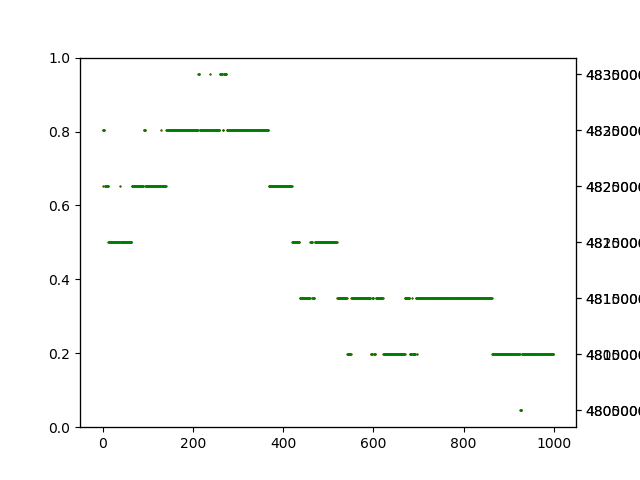
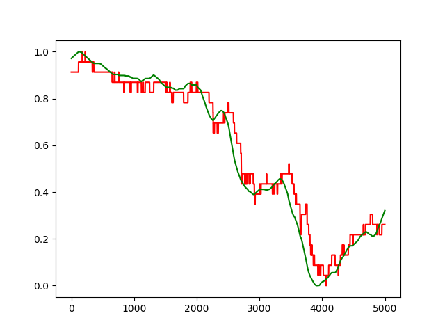
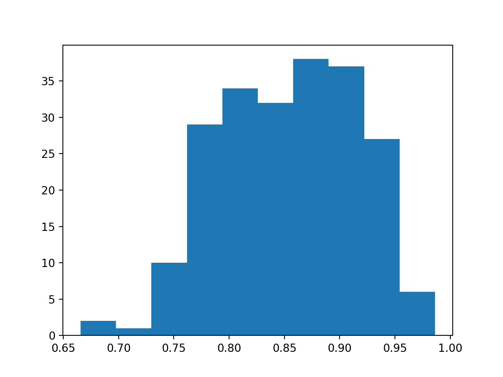
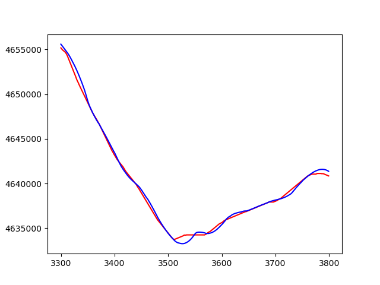
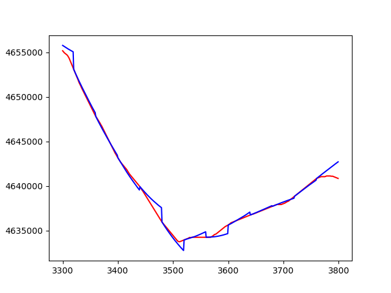

# 价格预测一实验报告

2015011313 徐鉴劲 计54

## 对数据集的分析

### 1. 买入卖出图分析

数据集有以下几个特点：

1. 价格的变化是以一个最小单位进行的。

2. 卖出、买入价格很长一段时间都保持不变，然后突然发生改变。

3. 卖出买入价格一般是同时变化的。

这张图展示的是卖出买入图，红色是买入价，绿色是卖出价。

|7-4/day, A1，前1000点|7-4/day, A3，前1000点|
|:--|:--|
|||

通过进一步分析askPrice, bidPrice的差，我发现有0.1%左右的情况会出现买卖价格不统一，如下图所示。有意思的是他们刚好是最小变动价格的两倍，通过更加具体的数据分析，我发现他们可以分为两种基本等概率的情况：

|种类|差额维持|差额扩大|
|:--|:--|:--|
|前后差额|2, 2|1, 2|

|买入价格减去卖出价格，7-4/day, A1|
|:--|
||

这种情况对于上涨、下跌的趋势预测没有本质上的影响。

## 对期货交易的理解

1. 实际上人们由于斤斤计较，一般会选择以一个最小的单位进行波动。所以系统内的订单应该是这个样子的：

|买入价|卖出价格|
|:--|:--|
|x+1|x|
|x|x+1|
|x-1|x+2|

无论买卖双方是否交易完成，都不会立刻完成下一笔交易：

|买卖相等|买家耗尽|卖家耗尽|
|:--|:--|:--|:--|
|x, x+1|x, x|x+1, x+1|

此时取消买卖请求对于价格来说都没有影响，因为结果必然是单调的。

所以，下一笔交易一定是新增的买卖请求，然后有三种情况：

种类|上涨|下跌|恒定|
|:--|:--|:--|:--|
|方法|买方+1|卖方-1|买方+1，卖方-1|
|效果|买入价与卖出价同时+1|买入价与卖出价同时-1|买入价与卖出价不变|

从数据上来看，大部分情况都属于“恒定”的。其中有0.1%的情况出现大差额维持和差额扩大，这里不做讨论。

## 数据集自动标注

使用给定方法进行的标注与直觉不符合，如下图。大量的上升下降趋势被错误标注了。

|20个点，$\theta_1=0.2\%, \theta_2=0.4\%$。其中灰色表示分类为不变。|
|:--|
||

其原因在于20个点的时间跨度太小了，我使用200为窗大小计算平均卖出价格，与原始的卖出价格对比如下。其中红色是原始卖出价格，绿色是平均后卖出价格。

|以200为窗口平均卖出价格，7-4/day, A1, 5000-10000|
|:--|
||

然后，我定义一个新的量，相对平均斜率：未来40个平均后的点，拟合的出来的直线斜率k，再除以当前平均价格。设原始价格为$y(x)$，平均后的价格为$\tilde y(x)$，对于平均价格拟合出来的斜率是$\tilde k(x)$，那么这个指标量可以表示为$\Phi(x) = C \frac{\tilde k(x)}{\tilde y(x)}$，其中C=10000，是一个扩大常数。

新方法标注的结果如下。各个颜色分别是深蓝-大幅下跌，浅蓝-小幅下跌，灰色-基本不变，橘红-小幅上升，红色-大幅上升。

图中的点代表原始卖出价，线代表平均后的价格。可以看出标注基本是符合直觉的。

|数据集标注，7-4/day, A1, 5000-10000|数据集标注，7-4/day, A1, 5000-10000|
|:--|:--|
|||

## 模型

在这里，我考虑对于每一个log文件分开处理，对于每一个合约分开处理。

### 模型一：Linear Logistic Regression

从过去100个点的平均价格回归出五类，使用了`sklearn.linear_model.LogisticRegression()`方法。实现的代码是如下几个函数：

`train.py`：

1. `linear_classify`完成了线性分类的实现，它首先调用`get_logistic_dataset`得到训练集合、测试集合，再调用`model.fit(train_X, train_Y)`调用sklearn库的训练函数拟合模型。

2. `get_logistic_dataset(dic)`从dict对象中提取出meanPrice序列与label序列。meanPrice序列作如下处理：每一百个点提取出来，放入训练矩阵中的一行，最终形成`(N_SAMPLE, 100)`大小的矩阵。label序列作如下处理：取100个以后的数据点，顺序排列，形成`(N_SAMPLE, 1)`的向量。然后这两个矩阵都对应取前80%作为训练数据集，20%作为测试数据集。

3. `testacc_logistic`中进行单个文件的测试。调用sklearn的`predict`函数得到结果，进行比较即可。

### 模型二：Naive Linear Regression

从过去100个点的平均价格回归出40个未来的价格点，然后使用与标定数据集相同的方法算出平均斜率，得到结果。实现这个功能的代码是：

`train.py`:

1. `linear_fit`完成了线性回归的实现，首先调用`get_linear_dataset`生成数据集，然后是sklearn的fit接口。

2. `get_linear_dataset`基本与`get_logistic_dataset`相同，不同的是它训练数据中的Y并不是一个点，而是四十个点，因为我们要回归四十个。

3. `testacc_linear`首先调用sklearn的接口`predict`，然后调用`linear2class`来将回归的结果求出平均斜率，然后进行分类。

4. `show_result_linear`函数进行了可视化，能够对比原始的meanPrice和预测出来的meanPrice的区别。

### 模型三：Smoothed Linear Regression

在模型二的基础上加上了平均，利用了不同时间段预测的结果。

## 评测

我采用的方法是：在用一个log文件中，使用前80%的数据作为训练数据集，后20%作为测试数据集。

### 结果

本结果中的正确率是按照每一个log文件等权重进行的平均后得到的，在数据频率上并不等权重。

#### 全数据集测试正确率

在整个数据集上测试的结果如下：

|Method|Smooth Linear Regression|Naive Linear Regression|Logistic Regression|
|:--|:--|:--|:--|
|Accuracy%|85.543|82.321|68.172|

可见Linear Regression远远好于Logistic Regression。其原因可能是在于在最后分类的时候，使用的是平均斜率这一个非线性函数。因为这于答案的结构是贴合的。而Logistic Regression全部仅仅只是一个线性权重而已，并不符合答案的结构。

Smooth Linear Regression是最好的方法，略好于朴素的Linear Regression，证明了时序信息的有效利用。

#### 分类稳定性

我将最好的方法Smooth Linear Regression对于每一份log文件的正确率进行了直方图统计：

|正确率分布||
|:--|:--|
|||

整体是较为稳定的，大多数集中在80%的正确率以上，没有出现较为严重的错误情况。

#### 数据集性质分析

对于每一份合约，是否其性质有所不同？对于白天和晚上，是否有所不同？

我研究了最好的方法（Smooth Linear Regression)下，不同数据上的表现：

|Instrument ID| A1| A3| B2 | B3|
|:--|:--|:--|:--|:--|
|Accuracy%|80.588|81.017|91.28|89.283|

|Time|Day|Night|
|:--|:--|:--|
|Accuracy%|85.618|85.449|

#### 线性回归的准确性

这里展示线性回归的结果，看线性模型拟合这个函数有多准确。其中红线是真实数据集合，蓝线是拟合的数据集合。

|Method|Smooth Linear Regression|Naive Linear Regression|
|:--|:--|:--|:--|
|拟合|||

我们可以看到拟合的结果实际上是十分准确的，这也保证了使用它的结果直接进行平均斜率计算就可以得到正确结果。

从两个图的对比可见，平滑的操作更加符合数据的内在结构，帮助排出了一些边角上的不稳定性，更加贴近曲线了。

## 重现结果

1. 第一、二部分的分析图: `python datanalysis.py`。

2. 训练结果图:`python runall.py`。

有些图并未包含在内。