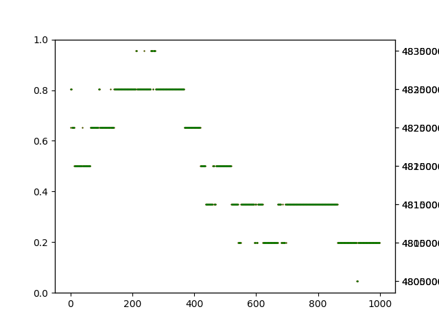
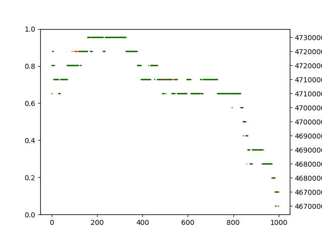
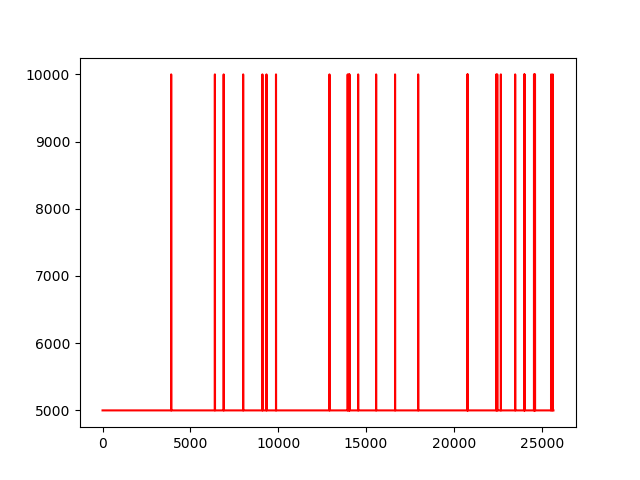
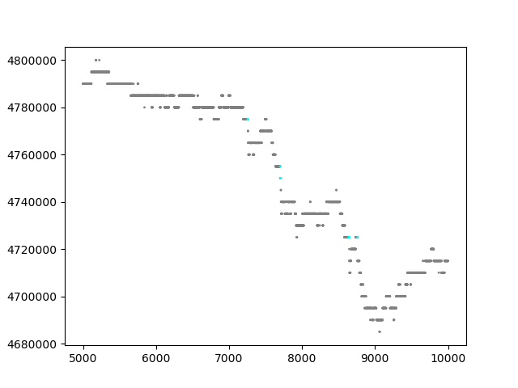
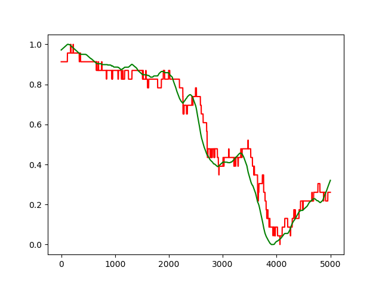
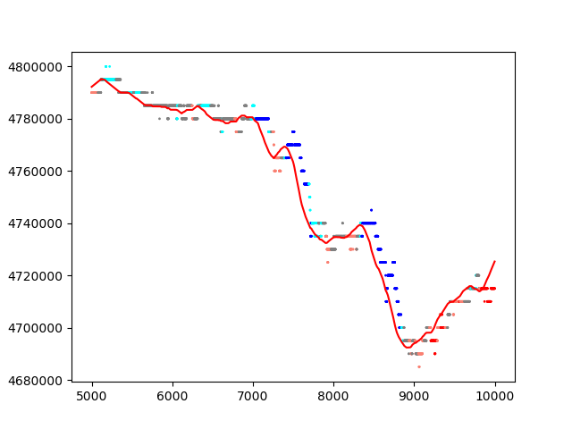

# 价格预测二 实验报告

徐鉴劲

## 引论

本实验报告记录了本小组在研究期货交易数据预测的问题中的思路、解法和最终效果，架构如下：

1. 期货交易数据分析。

2. 数据集自动标注方法，即如何标注“上升”“下降”的趋势。

3. 基线方法的实现。

4. 复杂方法的实现。

5. 实验结果与分析讨论。

6. 总结。

## 一、对期货交易数据的分析

### 1. 买入卖出图分析

通过简单观察，可以得到数据集的以下几个特点：

1. 价格的变化是以一个最小单位进行的。

2. 卖出、买入价格很长一段时间都保持不变，然后发生突变。

3. 卖出买入价格一般是同时变化的。

|7-4/day, A1，前1000点|7-4/day, A3，前1000点|
|:--|:--|
|||

这张卖出买入图中，红线是买入价，绿线是卖出价。以上三个特点在这副图中均有所体现。

进一步地，在全数据集上定量分析分析askPrice, bidPrice的差，绝大多数情况下买卖价格都是维持一个恒定差值的，但是也有大约0.1%左右的情况会出现买卖价格不统一，如下图所示。

|买入价格减去卖出价格，7-4/day, A1|
|:--|
||

有意思的是，所有异常情况都刚好是“最小变动价格”的两倍。再对他们进行数据统计，可以分为两种基本等频率的情况，“差额维持”和“差额扩大”。下表描述了这种情况，表中的1，2是以最小变动价格的倍数为表示的。

|种类|差额维持|差额扩大|
|:--|:--|:--|
|前后差额|2, 2|1, 2|

由于这些异常情况频率非常小，而且属于“尖峰”噪声，所以这种情况对于上涨、下跌的趋势预测没有本质上的影响，在本实验中我们忽略这种情况的存在。

### 2. 对期货交易的理解

1. 以一个最小的单位进行波动可能是由于人们斤斤计较造成的。所以系统内的订单可以表述成这样的形式：

|买入价|卖出价格|
|:--|:--|
|x+1|x|
|x|x+1|
|x-1|x+2|

无论买卖双方是否交易完成，都不会立刻完成下一笔交易：

|买卖相等|买家耗尽|卖家耗尽|
|:--|:--|:--|:--|
|x, x+1|x, x|x+1, x+1|

此时取消买卖请求对于价格来说都没有影响，因为结果必然是单调的。

所以，下一笔完成的交易一定是新增的买卖请求。这笔新增的交易有三种情况：

|种类|上涨|下跌|恒定|
|:--|:--|:--|:--|
|方法|卖家耗尽时，买方+1|买家耗尽时，卖方-1|买家耗尽时，买方+1；卖家耗尽时，卖方-1；买卖相等时，买方+1，卖方-1|
|新价格|(x+2, x+1)|(x, x-1)|(x+1, x)|

注意，上一次交易的价格是(x+1, x)，而这里说的卖方、买方加减，是相对于他们原先的订单说的。

从数据上来看，大部分情况都属于“恒定”的。其中有0.1%的情况出现大差额维持和差额扩大，这里不做讨论。

## 二、数据集自动标注方法

### 1. 最大变化标注方法

题目要求中

使用给定方法进行的标注与直觉不符合，如下图。大量的上升下降趋势被错误标注了。

|20个点，$\theta_1=0.2\%, \theta_2=0.4\%$。其中灰色表示分类为不变。|
|:--|
||

其原因在于20个点的时间跨度太小了，我使用200为窗大小计算平均卖出价格，与原始的卖出价格对比如下。其中红色是原始卖出价格，绿色是平均后卖出价格。

|以200为窗口平均卖出价格，7-4/day, A1, 5000-10000|
|:--|
||

然后，我定义一个新的量，相对平均斜率：未来40个平均后的点，拟合的出来的直线斜率k，再除以当前平均价格。设原始价格为$y(x)$，平均后的价格为$\tilde y(x)$，对于平均价格拟合出来的斜率是$\tilde k(x)$，那么这个指标量可以表示为$\Phi(x) = C \frac{\tilde k(x)}{\tilde y(x)}$，其中C=10000，是一个扩大常数。

新方法标注的结果如下。各个颜色分别是深蓝-大幅下跌，浅蓝-小幅下跌，灰色-基本不变，橘红-小幅上升，红色-大幅上升。

图中的点代表原始卖出价，线代表平均后的价格。可以看出标注基本是符合直觉的。

|数据集标注，7-4/day, A1, 5000-10000|数据集标注，7-4/day, A1, 5000-10000|
|:--|:--|
|||