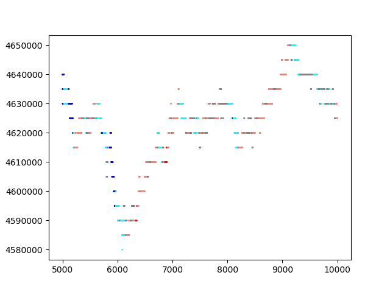

# 价格预测二 实验报告

徐鉴劲

## 引论

本实验报告记录了本小组在研究期货交易数据预测的问题中的思路、解法和最终效果，架构如下：

1. 期货交易数据分析。

2. 数据集自动标注方法，即如何标注“上升”“下降”的趋势。

3. 基线方法的实现。

4. 复杂方法的实现。

5. 实验结果与分析讨论。

6. 总结。

## 一、对期货交易数据的分析

### 1. 买入卖出图分析

通过简单观察，可以得到数据集的以下几个特点：

1. 价格的变化是以一个最小单位进行的。

2. 卖出、买入价格很长一段时间都保持不变，然后发生突变。

3. 卖出买入价格一般是同时变化的。

|7-4/day, A1，前1000点|7-4/day, A3，前1000点|
|:--|:--|
|||

这张卖出买入图中，红线是买入价，绿线是卖出价。以上三个特点在这副图中均有所体现。

进一步地，在全数据集上定量分析分析askPrice, bidPrice的差，绝大多数情况下买卖价格都是维持一个恒定差值的，但是也有大约0.1%左右的情况会出现买卖价格不统一，如下图所示。

|买入价格减去卖出价格，7-4/day, A1|
|:--|
||

有意思的是，所有异常情况都刚好是“最小变动价格”的两倍。再对他们进行数据统计，可以分为两种基本等频率的情况，“差额维持”和“差额扩大”。下表描述了这种情况，表中的1，2是以最小变动价格的倍数为表示的。

|种类|差额维持|差额扩大|
|:--|:--|:--|
|前后差额|2, 2|1, 2|

由于这些异常情况频率非常小，而且属于“尖峰”噪声，所以这种情况对于上涨、下跌的趋势预测没有本质上的影响，在本实验中我们忽略这种情况的存在。

### 2. 对期货交易的理解

1. 以一个最小的单位进行波动可能是由于人们斤斤计较造成的。所以系统内的订单可以表述成这样的形式：

|买入价|卖出价格|
|:--|:--|
|x+1|x|
|x|x+1|
|x-1|x+2|

无论买卖双方是否交易完成，都不会立刻完成下一笔交易：

|买卖相等|买家耗尽|卖家耗尽|
|:--|:--|:--|:--|
|x, x+1|x, x|x+1, x+1|

此时取消买卖请求对于价格来说都没有影响，因为结果必然是单调的。

所以，下一笔完成的交易一定是新增的买卖请求。这笔新增的交易有三种情况：

|种类|上涨|下跌|恒定|
|:--|:--|:--|:--|
|方法|卖家耗尽时，买方+1|买家耗尽时，卖方-1|买家耗尽时，买方+1；卖家耗尽时，卖方-1；买卖相等时，买方+1，卖方-1|
|新价格|(x+2, x+1)|(x, x-1)|(x+1, x)|

注意，上一次交易的价格是(x+1, x)，而这里说的卖方、买方加减，是相对于他们原先的订单说的。

从数据上来看，大部分情况都属于“恒定”的。其中有0.1%的情况出现大差额维持和差额扩大，这里不做讨论。

## 二、数据集自动标注方法

### 1. 最大变化标注方法

下面的数据是使用推荐的数据设定的标注方法，$\theta_1 = 1 \times 10^{-3}$, $\theta_2 = 2 \times 10^{-3}$，窗口大小是40（即大概是未来20s的数据），结果如下：

|7/4, A1, 5000~7000|7/4, A3, 5000~10000|
|:--|:--|
|||

在左边的图中，一些微小的波动使得标注结果发生了显著的变化，一段平稳的价格变化过程被标注成了复杂的上升下降过程。在右边的图中，有一段的价格发生了持续波动，这时候波动的顶峰会将自身分类为下降，而波动的低谷会将自身分类为上升，在标注的结果中二者快速地交替出现，违反直觉。

总结来说，给定的标注方法对于噪声的抵抗力差，对于快速振荡的价格产生了较大的分类错误。所以我考虑以一种更加稳定的方式进行数据集的标注。

### 2. 平均斜率标注方法

首先，假设有一个滑动窗口，大小为TLEN，假设价格是$price(i)$，那么首先定义平均价格：

$m(i) = average(price(i-\frac{TLEN}{2}:i+\frac{TLEN}{2}))$

这是以当前时刻为中心，对称的一个窗口。用这样的平均价格作为价格的表示，有着较好的直观性和稳定性，如下图所示。其中红线是卖出价格，绿线是平均价格。

|TLEN=100，7-4/day, A1, 5000-10000|
|:--|
||

可以看出，这个平均价格是符合人类直觉中的变化趋势的。

然后假设另一个滑动窗口，大小为$l$。从当前时刻向后的这个窗口内，拟合平均价格得到一条回归曲线，使用这条曲线的斜率作为标注的参考量，即：

$k(i) = \frac{\Phi(m(i:i+l))}{5000}$

除以5000是因为数据集中，价格的变化是以5000为基本单位的。

我选取一段随机数据，画出了这个斜率，如下图所示：

|7/4, A1, 5000~10000|7/4, A3, 5000~10000|
|:--|:--|
|||

图像中，红线是原始卖出价格，绿线是平均价格，其大小在左侧轴。蓝点是对应点处的斜率，其大小在右侧轴。

从这张图像中可以确定平均斜率分类的阈值。结合人眼对于图像的判断，我首先找到了我认为是快速下跌、下跌、上升、快速上升的片段，然后观察对应的平均斜率，发现他们具有较好的聚集特性，我据此选择了$\theta_1 = 0.005$和$\theta_2 = 0.02$作为阈值。

新方法标注的结果如下。各个颜色分别是深蓝-大幅下跌，浅蓝-小幅下跌，灰色-基本不变，橘红-小幅上升，红色-大幅上升。

图中的点代表原始卖出价，线代表平均后的价格。可以看出标注基本是符合直觉的，并且在第一种标注方法中的不稳定、处理不了震荡的情况都有所好转。

|7/4, A1, 5000~7000|7/4, A3, 5000~10000|
|:--|:--|
|||

## 三、基线方法

